# May 3: Started the schematic and thought about the direction.

Today I worked on the schematic of the devboard. I got to the point where I have to start adding pin headers.
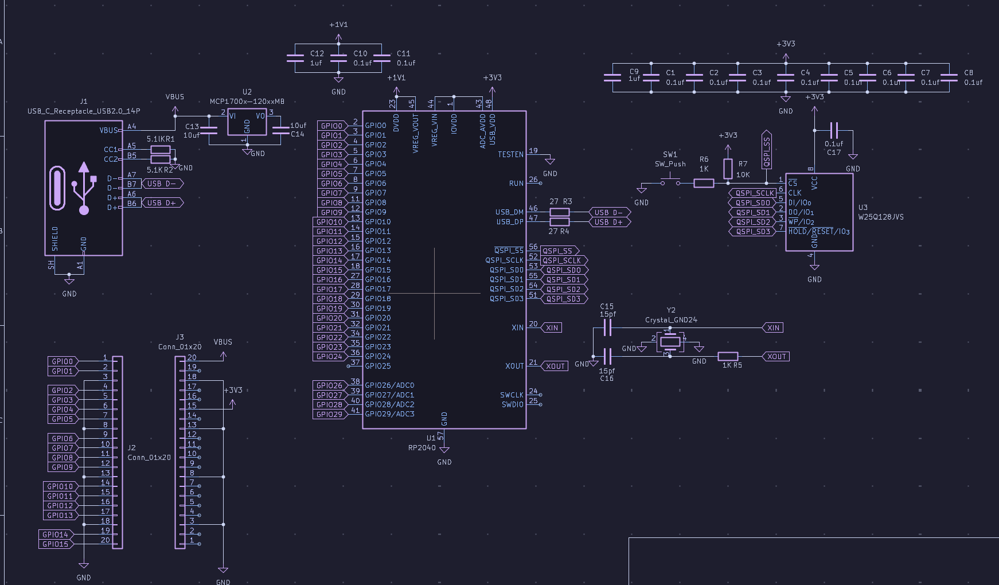
There is not much to say. I am mostly just setting things up until I can come up with an idea of what exactly I want this to be. There are three ideas that I am interested in: a devboard that has onboard sensors like temperature sensors, moisture sensors, etc., and solar panels and a battery. If I do this, I would have to create a case for this since it would be intended for outdoor use. Another way that this could go is I could make a slightly gaming-oriented dev board where you can easily create games using software that I would create as part of this project. With this idea, you would create breadboards/PCBs with different types of input to control the games. The last idea that I had was an education-centered dev board that comes with some software that would allow you to create programs very easily, so that younger children can get an introduction to STEM. I am leaning towards the first two ideas.

Recording links:
- https://public.lapse-hackclub.link/timelapses/DGkcKer8LFst/timelapse-DGkcKer8LFst.mp4

**Total time spent: 56 minutes**

# May 4: Chose a direction, added an OLED display and button

Today I worked on continuing the tutorial. I felt really tired and really not aware today, so progress was slower than I would have liked. I decided to go the route of gaming and education. I plan on making a tool so that people can get into STEM. I decided to add a general input button along with an OLED display(SSD1306). I overall think that I made ok progress. I also laid out the general placement of the components for the PCB.
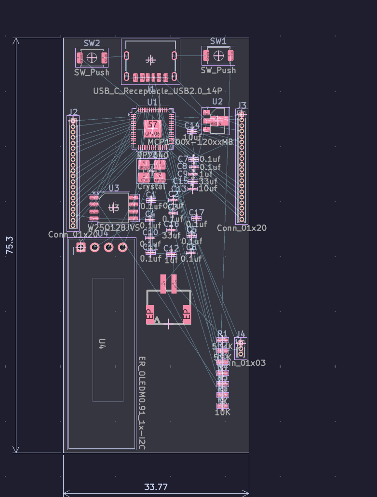
I think that having the OLED screen on the outer reaches away from the pins is a bad design choice. I will probably make the devboard wider, not longer, to accommodate this. Honestly, I am not even sure if this can qualify as a devboard, considering it is becoming more like Sprig.

Recording links:
- https://public.lapse-hackclub.link/timelapses/7_ZJfe8KnYUe/timelapse-7_ZJfe8KnYUe.mp4

**Total time spent: 1:06 hours**

# May 5: Routed the flash memory and USB port

Today, I worked mostly on getting some of the routing done. I followed the advice outlined in the custom devboard guide by doing the flash memory first instead of doing anything else. I took a lot of time to make sure that I could do everything in that area without using vias.

I did have issues with this, and I had to restart on this a couple of times. I also decided to try to work on trying to route the USB port. About halfway through doing this, I realized that I had used the wrong footprint. I changed it, but I had to kind of restart. Routing this was not as bad as routing the flash memory, though.

Aside from this, I am still not sure if the direction that I am going with the devboard is necessarily good. The screen is nice, but it feels too large, and the fact that it will take up a GPIO pin that cannot be used by whoever will end up using the devboard is kinda upsetting, but also it is something that makes sense. I will have to go on and see whether this is actually worth it or not.

Recording links:
- https://public.lapse-hackclub.link/timelapses/LOK1z_V-Vksl/timelapse-LOK1z_V-Vksl.mp4
- https://public.lapse-hackclub.link/timelapses/FhLKLNGlcSYP/timelapse-FhLKLNGlcSYP.mp4

**Total time spent: 1:09 hours**

# May 6: More routing and via struggles

Today was another day of routing things. I feel like today was less productive than normal, though. I spend a lot of time trying to figure out "tune length of single track". I also spend a fair bit of time trying to get the component placement right. I ended up having to move the decoupling capacitors slightly above the RP2040 footprint to avoid having the route around them when it came time to route the pinheaders. Overall, my main struggles today were trying to route around the flash memory module. I ended up having to use lots and lots of vias, which I am not super proud of. I really do not feel like restarting the process though. Tomorrow I need to wrap up some of the routing and make sure that I do not have any 90-degree traces or anything.
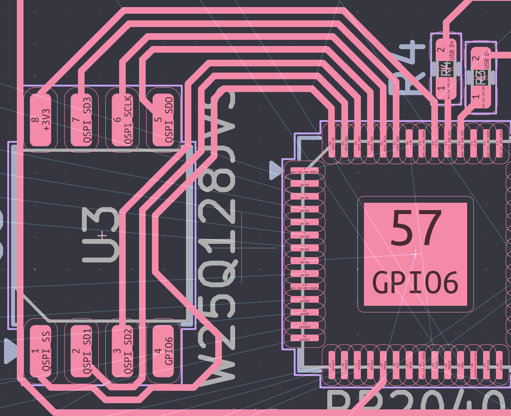
As a bit of a side note, here is my progress. As you can see, the traces on the left have lots of very messy vias scattered around. I also got stuck researching a bit about whether vias could be used when routing the crystal oscillator. I found out that I could but I decided against it.

Recording links:
- https://public.lapse-hackclub.link/timelapses/aq-a-650iFIS/timelapse-aq-a-650iFIS.mp4

**Total time spent: 1:27 hours**

# May 7: Finished GPIO routing, added GND fill

Today was a fairly productive day. Pretty much just routed more of the PCB today. I first finished up all the GPIO pin routing. I struggled a lot with this since the flash memory module blocked off a lot of the RP2040. I had to use very many vias for this.
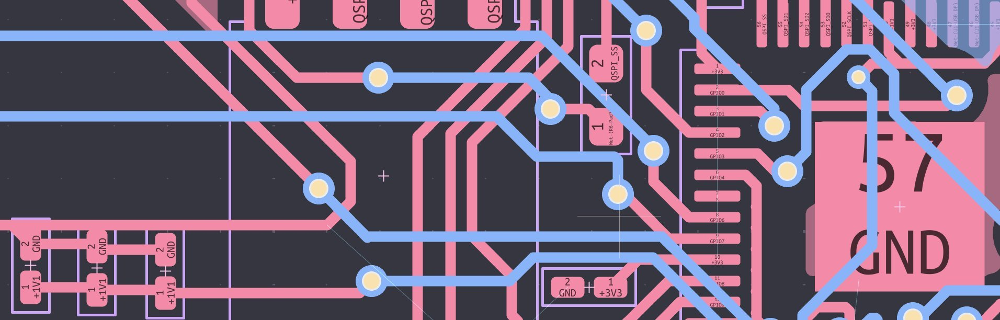
Here is a screenshot of the general area that was affected by this. The next thing that I did was add GND fill to the board. This did not cover all of the GND connections, so I will need to work on making sure that all the GNDs are connected. The next thing that I did was try to connect the 1V1 to the decoupling capacitors.
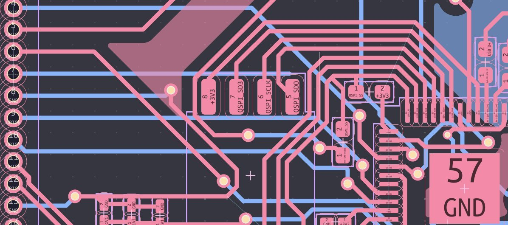
It is probably hard to tell from the picture, but the trace connecting the 1v1s with the decoupling capacitors is very very very very very very very very very long. I don't really know how much this will affect the pcb nor how much it will be effected but I will work to make the length shorter

**Todo**
- FInish routing the GNDs
- Shorten the 1v1 trace
- Finish the 3v3 trace from the decoupling capacitors.

Recording links:
- https://public.lapse-hackclub.link/timelapses/nqFdDxovM8Hh/timelapse-nqFdDxovM8Hh.mp4

**Total time spent: 1:17 Hours**

# May 13: Wrapped up more routing

Today I did more routing. Like with barrel roll, there isn't much to talk about. However, for the time I was trying to work, I felt like I worked a lot more. I had some struggles trying to make sure that nothing was really terribly routed or had really difficult trace lengths. The one thing that I am not super sure about is that I put one of the resistors for the USB port on the other side of the USB port. I am not sure if this will affect it. I do not think so, since it is not a signal-carrying wire. The next steps for me would be to wrap up the routing and work on the software platform.
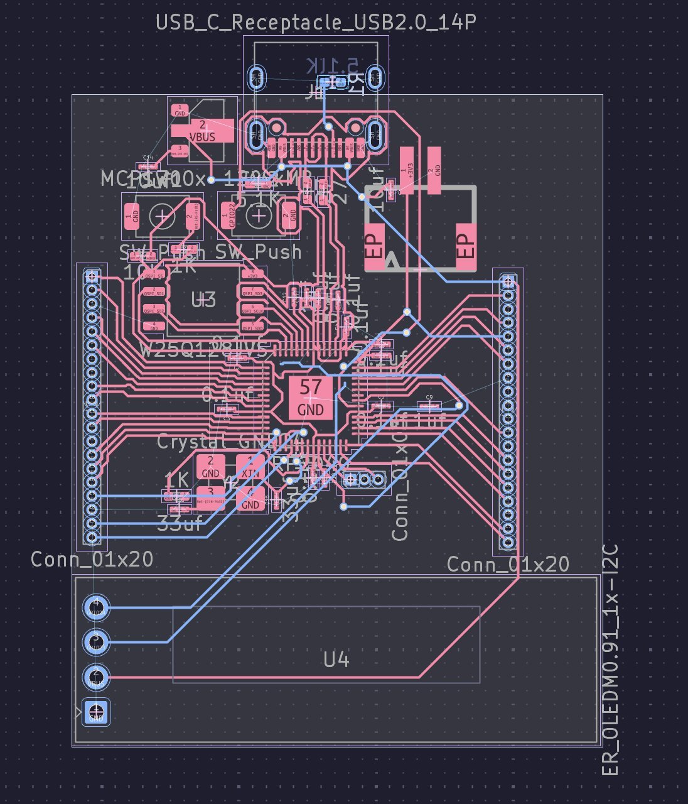
Here is a picture of progress so far.

Recording links:
- https://public.lapse-hackclub.link/timelapses/pCT4w-ZVqyHo/timelapse-pCT4w-ZVqyHo.mp4
- https://public.lapse-hackclub.link/timelapses/vtBHhhoqcy5y/timelapse-vtBHhhoqcy5y.mp4
- https://public.lapse-hackclub.link/timelapses/U8BlEgYKHTOK/timelapse-U8BlEgYKHTOK.mp4
- https://public.lapse-hackclub.link/timelapses/r_VSW0o6QzoZ/timelapse-r_VSW0o6QzoZ.mp4

**Total time spent: 37 minutes**

# May 14: Redid the routing around the decoupling capacitors

In this devlog, I set up the basic layout and routing for the devboard. I decided to redo the routing that I had already done because the trace length on the 1v1 trace was too long for it to work properly. So it was mostly a repeat of what happened earlier, but I did the decoupling capacitors first. The difference was that I simply placed everything with respect to the capacitors.

This is what I have right now. The next thing that I have to do is I have to route everything else and work on the software platform for the project. In hindsight, I probably should have created a planning doc for larger projects like this.
Note to reviewers: I made the original version of this devlog on May 12.

Recording links:
- https://public.lapse-hackclub.link/timelapses/Pfab0-hPdquu/timelapse-Pfab0-hPdquu.mp4
- https://public.lapse-hackclub.link/timelapses/LPbBbGXVQzN0/timelapse-LPbBbGXVQzN0.mp4

**Total time spent: 45 minutes**

# May 18: Finished up the PCB

Today I worked on finishing up the PCB. I almost had to restart for the second time because I thought that I had messed up the placement of the decoupling capacitors. I really didn't struggle too much with this, as it did not take up that much time.
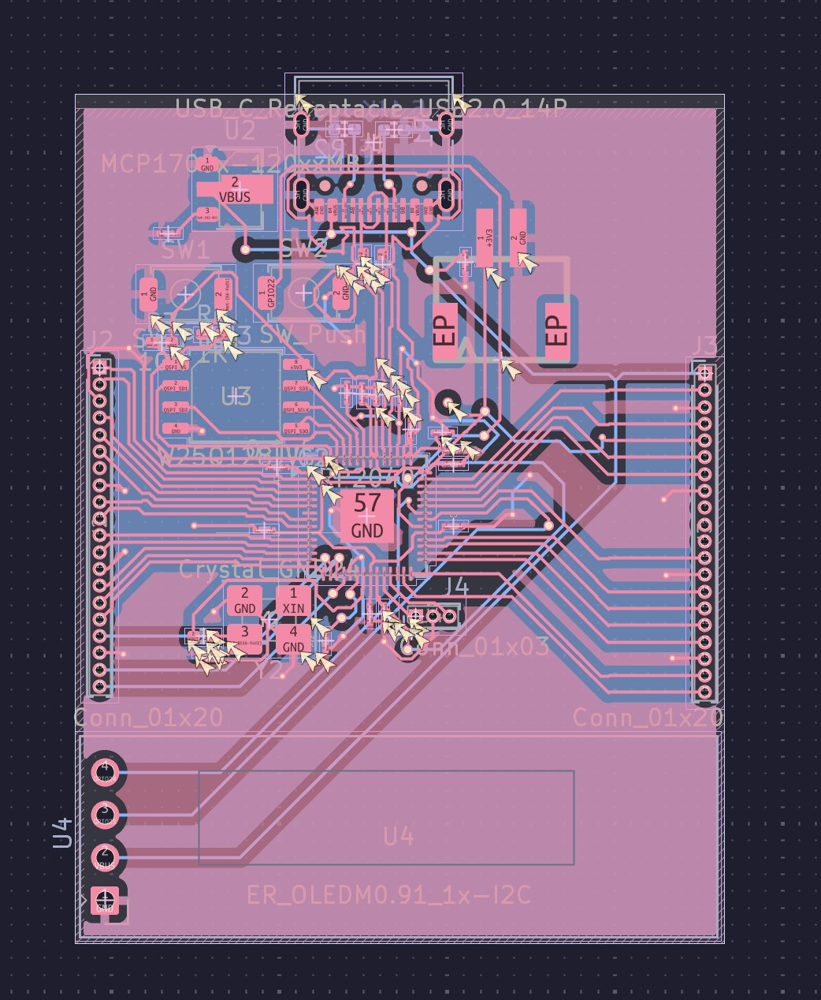
This is what the almost finished PCB looks like. One thing that did trip me up during all of this is that I did not set up the DRC correctly according to the JLCPCB capabilities. Yeah, I really can't say much more. The next steps for me would be to get the silk screen art done. I want to work on the basic firmware that all the education features would work on top of.

Recording links:
- https://public.lapse-hackclub.link/timelapses/dfIe_jsVfIqO/timelapse-dfIe_jsVfIqO.mp4

**Total time spent: 1:03 hours**

# May 21: Silkscreen art and naming the board

Today, I mostly worked on the art of the devboard. I also decided on a name while making the art. I decided to go with a cartoony theme with handwritten letters in Excalidraw. I also opted for some hand-drawn graphics. I really think that they don't look the greatest. The first thing that I did to try to do this was to have a draft. I basically got the layout of each part of the PCB silkscreen.

This is the draft image that I got. The next thing I tried was to export all the different parts as a graphic in KiCad. One challenge that I had during this was that I had an error that said "No graphic items found in file." The problem was that I had used vert.sh to change my existing .png files to .svg files instead of exporting them separately. According to a KiCad forms thread, the issue was caused by having the .svg not in Unix (FL) format. The next thing that I did was I got everything arranged.
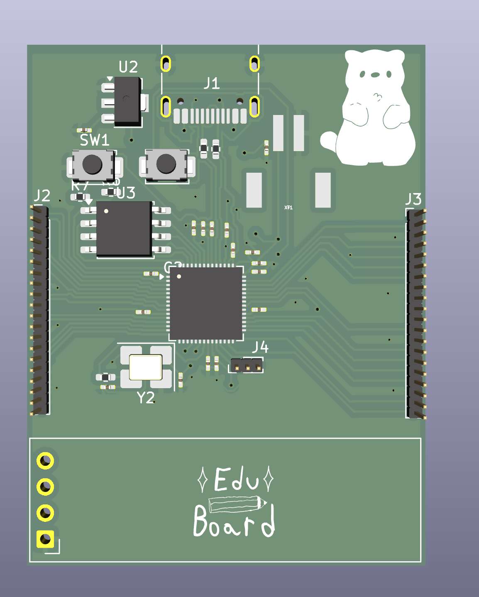
Here is what the pcb looks like right now.

Recording links:
- https://public.lapse-hackclub.link/timelapses/pjo93tp7kQIv/timelapse-pjo93tp7kQIv.mp4

**Total time spent: 1:08 Hours**

# May 22: Splash screen firmware and starting the software platform

Today I worked on creating some of the firmware and the software platform. The first thing that I did was create a real quick splash screen for the OLED screen. I just used an online tool for this The next thing that I tried to do was work on the software platform. I will probably make a desktop/web app using Godot. One thing that I struggled with was figuring out how exactly to communicate with the devboard over USB. Apparently, the way to do it is that you have to use C# and use System.IO.Ports to use a serial port that is named something. There was not as much struggle since this was mostly just setting up boilerplate code.

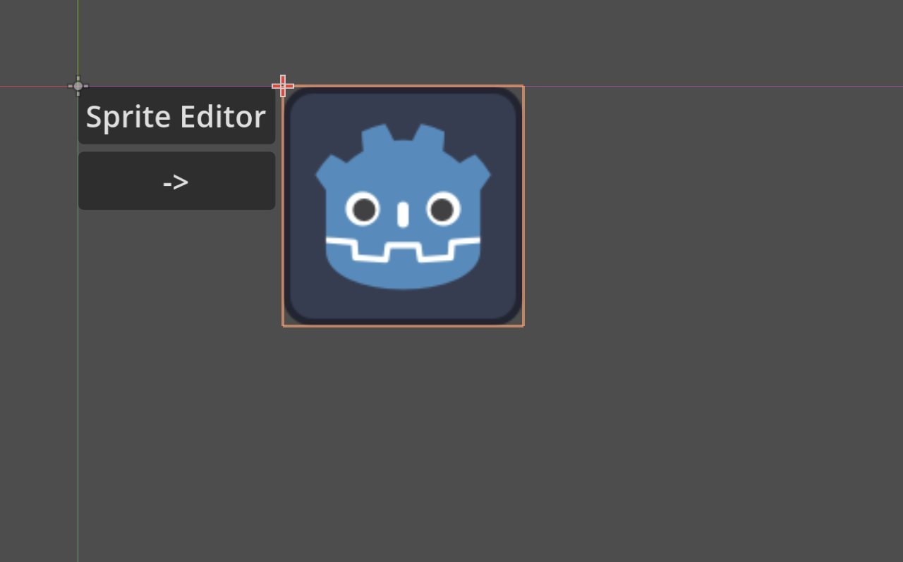
This is what I am trying to set up right now.

Recording links:
- https://public.lapse-hackclub.link/timelapses/RL9jTkZymbQ6/timelapse-RL9jTkZymbQ6.mp4

**Total time spent: 1:08**

# May 27: Godot constructor blocks and sprite editor

Today was not the best day in terms of productivity. The main thing that I worked on was the Godot constructor part of the project. I tried to come up with some of the blocks that would be used in the constructor. I decided to use something like Scratch to create the blocks.

Right now, this is what they look like. In addition to creating the blocks themselves. I also worked on getting the snapping logic to work. I know that it doesn't work, but I think that it should be fine enough. Another thing that I tried to do during this time was to get a sprite editor working. The main struggle with this was how I was going to integrate the sprite editor into the current project(I just stole on from my fantasy console project). THe next thing that I will do is I will work on getting the constructor bricks working.

Recording links:
- https://public.lapse-hackclub.link/timelapses/THLCydzMLRA7/timelapse-THLCydzMLRA7.mp4

**Total time spent: 55 minutes**

# May 28: Getting the UI set up

Today, I worked on trying to get the UI set up for the devboard. The main thing that I worked on was trying to get the Hboxes to work. The main struggle today was trying to find the correct settings to make the textured rects that represented the constructors actually resize properly. I don't have a lot of time to finish this devlog, and honestly, I might just export this to Horizons.
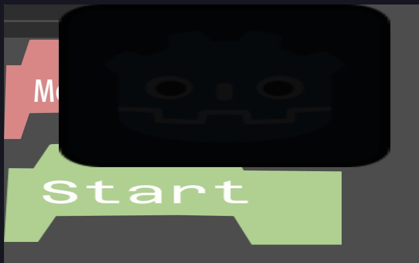
This is what the first iteration looked like. In this one I simply forgot to make the workspace a part of a vbox. The second iteration is here
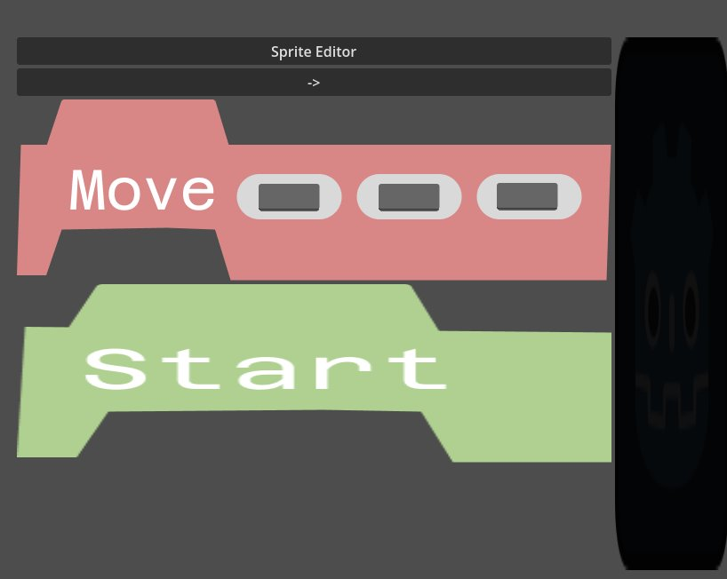 Here is pretty much where I fixed it. This is what it looks like now.
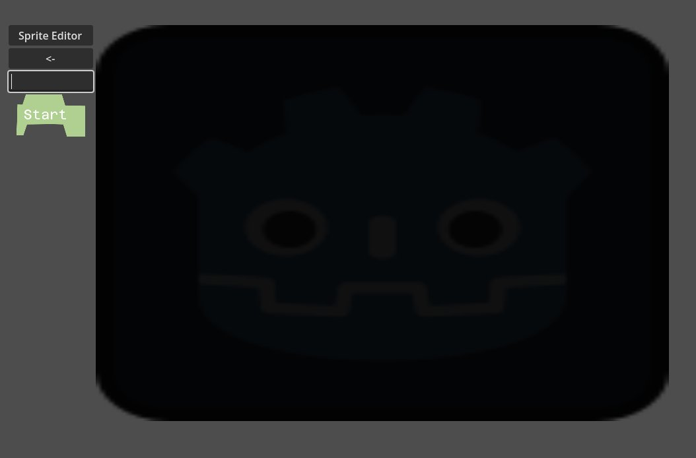
I think that I messed up the display for the first one somehow. I really don't know how much time this is going to take. These concepts lowk should feel easy to remember since the other Godot projects that I worked on. The next things that I need to do are I need to: ~~Fix the first constructor's display(something to do with the text box)~~. Fix the drag detection (should be pretty simple, tbh). In addition, I need to work on the snapping logic. The thing with it is that I just got the logic off of my tower plinko prototype thing. The main concern is that I don't think that everything translated properly.(Yea it doesn't work) I think that there is an issue with the way I reimplemented the code from towerplinko.

**Total time spent: 0.0**

# August 22: Getting the drag and drop logic working.

It has been a while, In this devlog I tried to reform the drag and drop logic. I found out that there is a way to do this with built in stuff from godot. Yea, this isn't the greatest. It took a embarringly long to get used to what I did earlier and to do this. The next thing I need to do is I need to make it so that the block dragging works like scratch. I also need to make the UI actually look good. 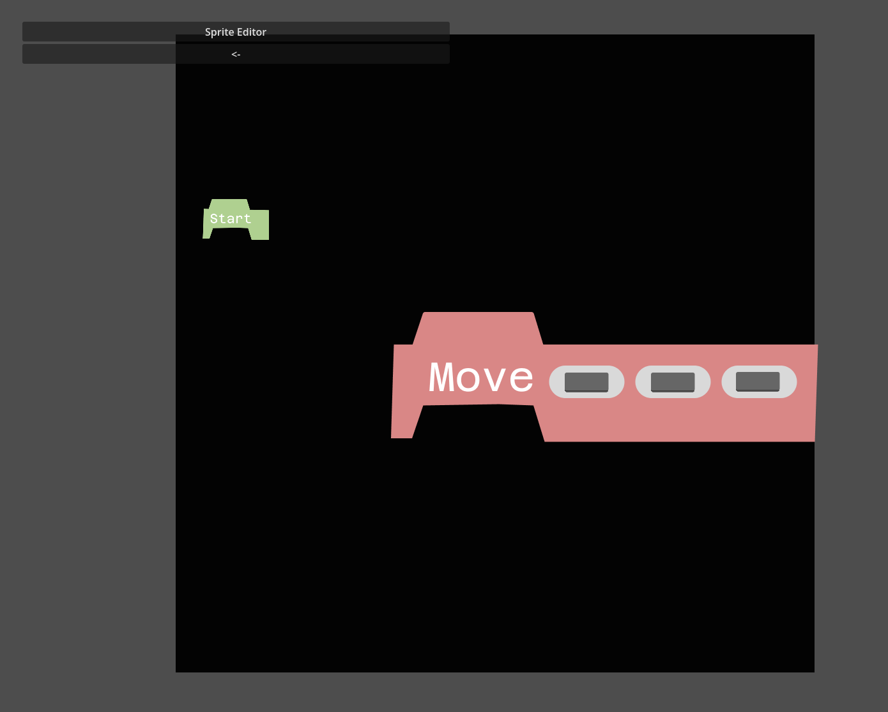. This is what it looks like right now. I also tried to use opencode to reformat the journal.md that was exported from fallout a long time ago.

**Total time spent: 3:12**

# September 1: BOM and wrapping up the pcb

I really think that I should be more focused on the BOM and finishing up the PCB. I think I will work on the software parts after(I am still not super sure if I can even really do it since it is very heavy in terms of software). Besides finishing up the BOM, I got some advice in #electronics and found that trying to power the RP2040 with a battery exceeds the maximum amount of voltage you are supposed to use to power the RP2040. I decided to use the TPS63000DRCR Buck-Boost converter to solve this. 

This is what it looks like on the pcb at the moment. I also got some work done on the BOM, There is not really anything I have to say about it. The main thing I still need to do from it is I need to check some of the footprints and I need to figure out how much it will cost for a partial PCBA since I cannot properly do surface mount sodering. 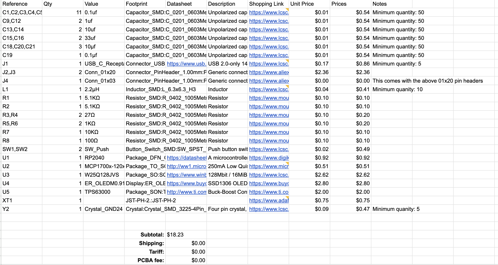. Is it weird that I am somewhat proud of how much more organized it is compared to my last hardware projects??? I also need check the footprints. I also did some searching for parts. The next thing I will do is I will be trying to is to try to get 3d models for the components and try to render it.

Recording links:
https://lapse.hackclub.com/timelapse/1ukHRfGwRLbr (53 mins)
https://lapse.hackclub.com/timelapse/UjBjIMcLNt3x (47 mins)
https://lapse.hackclub.com/timelapse/hDr_HyoGHTTv (25 mins)

**Total time spent: 2:05 hours**

# September 2: 
This devlog I worked on several things. Yesterday I got a start on finding the 3d models for the components so that the render actually looked good. I don't have alot to say other than for one of the components(The battery connector), the breakout board was attached in the CAD model. .
Here it is. Next I worked on trying to make the actual render. This was harder than I thought because I originally thought. This is mostly because I was trying to figure out how to make it look good. Most of the previous ones did not look good to me at all.  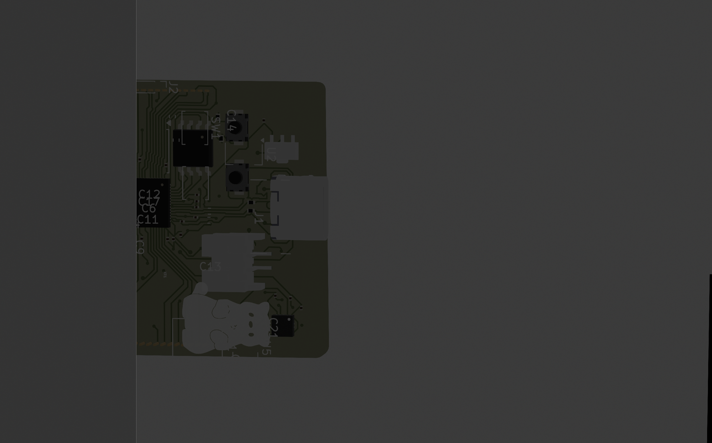 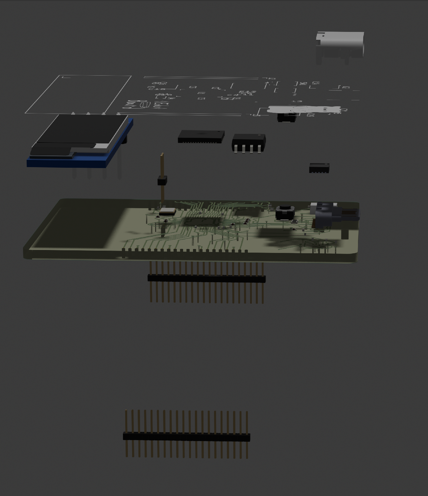 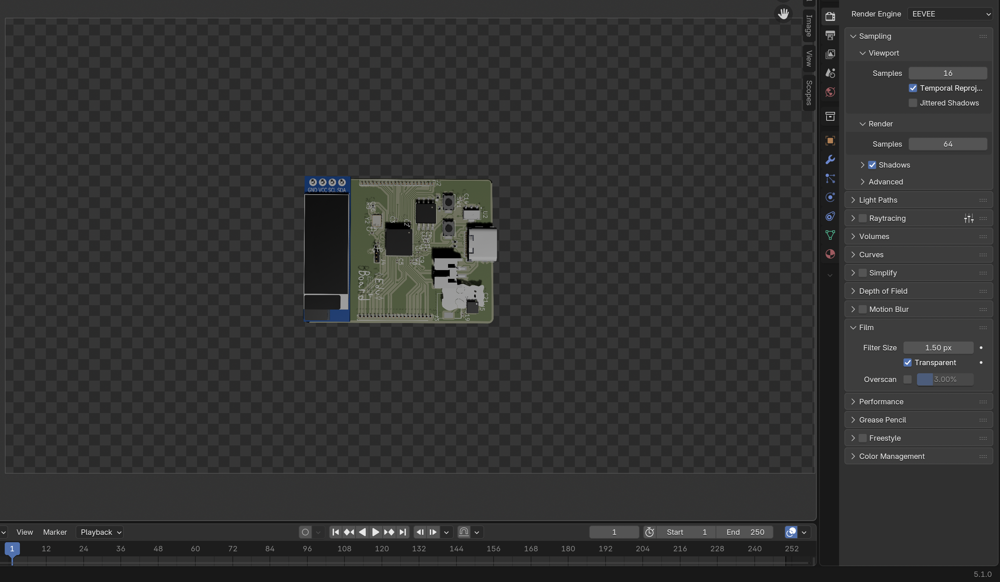. Here are some of the failed ones. As you can probably tell. I decided to go with two different rendering styles, one of the styles would be the exploded view and the straight down view.  and  . I also decided to work on the poster. 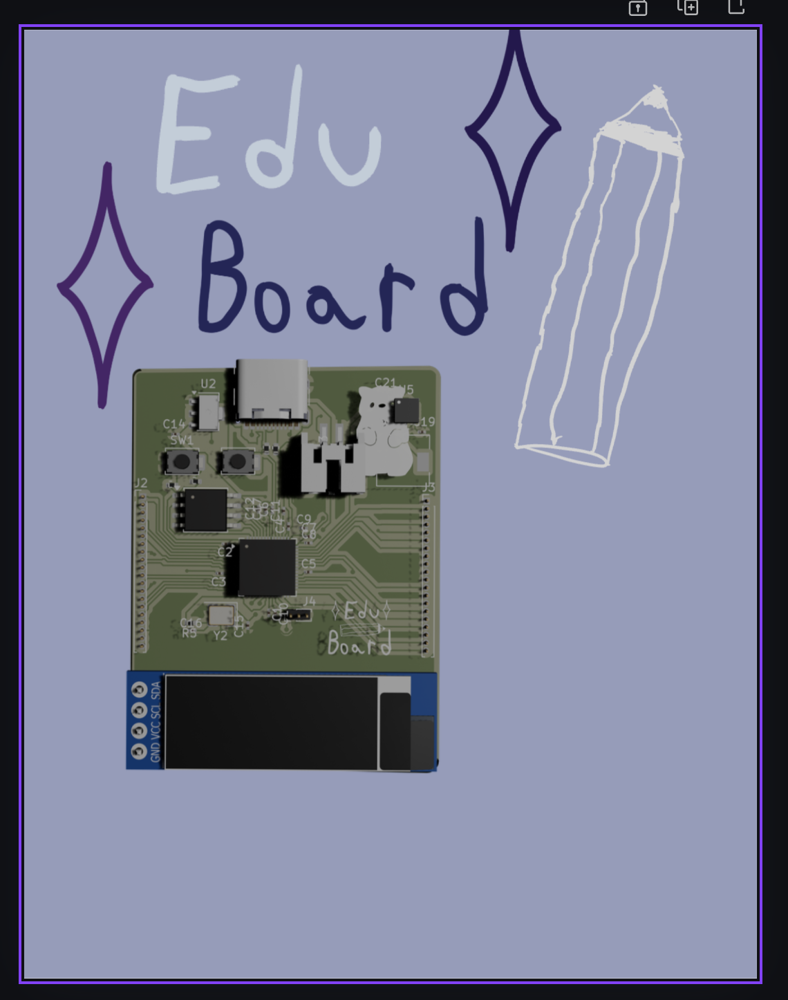. This is what it looks like right now. I might deviate from my usual use of pastel colors though. I am not super sure about what I will do next. I do really need to work on the software platform though. I am not super sure if I can get that done in time before forge ends. I will realistically use AI to accelerate this process.

Recording links:
https://lapse.hackclub.com/timelapse/PKU9Cg7YqvJJ
https://lapse.hackclub.com/timelapse/CI43GkyVtSil
They are both 1:12-11 lol

**Total Time spent: 2:23 hours**

# September 3
prejournal: I havent got off school yet but I am dtsrting to decide what I need to do. I will be truijg to 