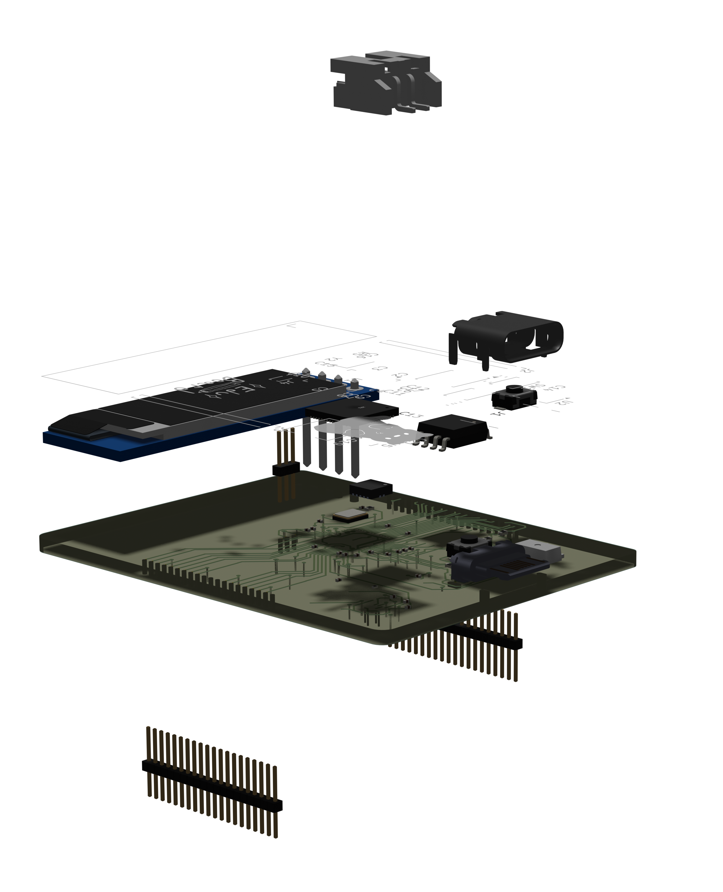

# Eduboard
A devboard with an inbuilt screen and a software platform that should help beginners learn the basics of computer science. This is a rp2040 devboard at it's core.

I made this project because I wanted some experience working with devboards before I start something more complex. I also wanted to make something where a microcontroller was on a devboard already.

### Pictures

Above are renders made in blender.

### Assembly
The assembly of the devboard is relatively straight forward. The first thing you need to do is you need to get a hotplate and some soder paste to carefully soder on all the SMD components onto the pcb(This will be new to me as I have never done it before). Then you need to soder on the header pins onto the pcb by placing your sodering iron on the joint between the pcb and the pin and putting solder into that joint.

### Flashing
The flashing of this works the same way as a normal raspberry pi pico. You need to hold down SW_1 to start the flashing process.

### BOM
This BOM is for non PCBA. 

| Reference                           | Qty | Value                       | Footprint                                                  | Datasheet                                                                         | Description                                                                                                         | Shopping Link                                                                                                                                                                                                                                                                                                                                                                                                                                                                                                                                                                                                                                                    | Unit Price | Prices | Notes                                       |
|-------------------------------------|-----|-----------------------------|------------------------------------------------------------|-----------------------------------------------------------------------------------|---------------------------------------------------------------------------------------------------------------------|------------------------------------------------------------------------------------------------------------------------------------------------------------------------------------------------------------------------------------------------------------------------------------------------------------------------------------------------------------------------------------------------------------------------------------------------------------------------------------------------------------------------------------------------------------------------------------------------------------------------------------------------------------------|------------|--------|---------------------------------------------|
| C1,C2,C3,C4,C5,C6,C7,C8,C10,C11,C17 | 11  | 0.1uf                       | Capacitor_SMD:C_0201_0603Metric_Pad0.64x0.40mm             |                                                                                   | Unpolarized capacitor                                                                                               | https://www.lcsc.com/product-detail/C76930.html?s_z=n_q_p_Capacitor_SMD%253AC_0201_0603Metric_Pad0.64x0.40mm&spm=wm.ssy.bg.0.xh&lcsc_vid=E1MNX1EDFlVaVF0CR1dYUVRWE1hcUFBQRgNcBF1QRwUxVlNeT1NdVlNeQ1VZVDsOAxUeFF5JWBYZEEoKFBINSQcJGk4dAgUUFAk%3D                                                                                                                                                                                                                                                                                                                                                                                                                  | $0.01      | $0.54  | Minimum quantity: 50                        |
| C9,C12                              | 2   | 1uf                         | Capacitor_SMD:C_0201_0603Metric_Pad0.64x0.40mm             |                                                                                   | Unpolarized capacitor                                                                                               | https://www.lcsc.com/product-detail/C76930.html?s_z=n_q_p_Capacitor_SMD%253AC_0201_0603Metric_Pad0.64x0.40mm&spm=wm.ssy.bg.0.xh&lcsc_vid=E1MNX1EDFlVaVF0CR1dYUVRWE1hcUFBQRgNcBF1QRwUxVlNeT1NdVlNeQ1VZVDsOAxUeFF5JWBYZEEoKFBINSQcJGk4dAgUUFAk%3D                                                                                                                                                                                                                                                                                                                                                                                                                  | $0.01      | $0.54  | Minimum quantity: 50                        |
| C13,C14                             | 2   | 10uf                        | Capacitor_SMD:C_0201_0603Metric_Pad0.64x0.40mm             |                                                                                   | Unpolarized capacitor                                                                                               | https://www.lcsc.com/product-detail/C76930.html?s_z=n_q_p_Capacitor_SMD%253AC_0201_0603Metric_Pad0.64x0.40mm&spm=wm.ssy.bg.0.xh&lcsc_vid=E1MNX1EDFlVaVF0CR1dYUVRWE1hcUFBQRgNcBF1QRwUxVlNeT1NdVlNeQ1VZVDsOAxUeFF5JWBYZEEoKFBINSQcJGk4dAgUUFAk%3D                                                                                                                                                                                                                                                                                                                                                                                                                  | $0.01      | $0.54  | Minimum quantity: 50                        |
| C15,C16                             | 2   | 33uf                        | Capacitor_SMD:C_0201_0603Metric_Pad0.64x0.40mm             |                                                                                   | Unpolarized capacitor                                                                                               | https://www.lcsc.com/product-detail/C76930.html?s_z=n_q_p_Capacitor_SMD%253AC_0201_0603Metric_Pad0.64x0.40mm&spm=wm.ssy.bg.0.xh&lcsc_vid=E1MNX1EDFlVaVF0CR1dYUVRWE1hcUFBQRgNcBF1QRwUxVlNeT1NdVlNeQ1VZVDsOAxUeFF5JWBYZEEoKFBINSQcJGk4dAgUUFAk%3D                                                                                                                                                                                                                                                                                                                                                                                                                  | $0.01      | $0.54  | Minimum quantity: 50                        |
| C18,C20,C21                         | 3   | 10μf                        | Capacitor_SMD:C_0201_0603Metric_Pad0.64x0.40mm             |                                                                                   | Unpolarized capacitor                                                                                               | https://www.lcsc.com/product-detail/C76930.html?s_z=n_q_p_Capacitor_SMD%253AC_0201_0603Metric_Pad0.64x0.40mm&spm=wm.ssy.bg.0.xh&lcsc_vid=E1MNX1EDFlVaVF0CR1dYUVRWE1hcUFBQRgNcBF1QRwUxVlNeT1NdVlNeQ1VZVDsOAxUeFF5JWBYZEEoKFBINSQcJGk4dAgUUFAk%3D                                                                                                                                                                                                                                                                                                                                                                                                                  | $0.01      | $0.54  | Minimum quantity: 50                        |
| C19                                 | 1   | 0.1μf                       | Capacitor_SMD:C_0201_0603Metric_Pad0.64x0.40mm             |                                                                                   | Unpolarized capacitor                                                                                               | https://www.lcsc.com/product-detail/C76930.html?s_z=n_q_p_Capacitor_SMD%253AC_0201_0603Metric_Pad0.64x0.40mm&spm=wm.ssy.bg.0.xh&lcsc_vid=E1MNX1EDFlVaVF0CR1dYUVRWE1hcUFBQRgNcBF1QRwUxVlNeT1NdVlNeQ1VZVDsOAxUeFF5JWBYZEEoKFBINSQcJGk4dAgUUFAk%3D                                                                                                                                                                                                                                                                                                                                                                                                                  | $0.01      | $0.54  | Minimum quantity: 50                        |
| J1                                  | 1   | USB_C_Receptacle_USB2.0_14P | Connector_USB:USB_C_Receptacle_HRO_TYPE-C-31-M-12          | https://www.usb.org/sites/default/files/documents/usb_type-c.zip                  | USB 2.0-only 14P Type-C Receptacle connector                                                                        | https://www.lcsc.com/product-detail/C165948.html?spm=wm.fly.bg.0.xh&lcsc_vid=E1MNX1EDFlVaVF0CR1dYUVRWE1hcUFBQRgNcBF1QRwUxVlNeT1NdVlRQT1BdXjsOAxUeFF5JWBILBhYFH08MFQUQEk8NCAlJJ                                                                                                                                                                                                                                                                                                                                                                                                                                                                                   | $0.17      | $0.86  | Minimum quantity: 5                         |
| J2,J3                               | 2   | Conn_01x20                  | Connector_PinHeader_1.00mm:PinHeader_1x20_P1.00mm_Vertical |                                                                                   | Generic connector, single row, 01x20, script generated (kicad-library-utils/schlib/autogen/connector/)              | https://www.aliexpress.us/item/3256811704196969.html?spm=a2g0o.order_list.order_list_main.5.52e91802DwzU5C&gatewayAdapt=glo2usa                                                                                                                                                                                                                                                                                                                                                                                                                                                                                                                                  | $2.36      | $2.36  |                                             |
| J4                                  | 1   | Conn_01x03                  | Connector_PinHeader_1.00mm:PinHeader_1x03_P1.00mm_Vertical |                                                                                   | Generic connector, single row, 01x03, script generated (kicad-library-utils/schlib/autogen/connector/)              | https://www.aliexpress.us/item/3256811704196969.html?spm=a2g0o.order_list.order_list_main.5.52e91802DwzU5C&gatewayAdapt=glo2usa                                                                                                                                                                                                                                                                                                                                                                                                                                                                                                                                  | $0.00      | $0.00  | This comes with the above 01x20 pin headers |
| L1                                  | 1   | 2.2μH                       | Inductor_SMD:L_6.3x6.3_H3                                  |                                                                                   | Inductor                                                                                                            | https://www.lcsc.com/product-detail/C52722262.html?s_z=h_q_inductor%25202.2uh&spm=wm.fly.bg.0.xh&lcsc_vid=E1MNX1EDFlVaVF0CR1dYUVRWE1hcUFBQRgNcBF1QRwUxVlNeT1NdV1xeRlFYVjsOAxUeFF5JWBYZEEoKFBINSQcJGk4eFQsCAgIaSgADAwAHC0slQ1lZX1dVR1NADxALGw%3D%3D                                                                                                                                                                                                                                                                                                                                                                                                               | $0.04      | $0.41  | Minimum quanity: 10                         |
| R1                                  | 1   | 5.1KΩ                       | Resistor_SMD:R_0402_1005Metric_Pad0.72x0.64mm              |                                                                                   | Resistor                                                                                                            | https://www.mouser.com/en/ProductDetail/Vishay/CRCW04025K10FKED?qs=s0g2FHNyNFj8r6Uw5EJZ%2Fw%3D%3D                                                                                                                                                                                                                                                                                                                                                                                                                                                                                                                                                                | $0.10      | $0.10  |                                             |
| R2                                  | 1   | 5.1KΩ                       | Resistor_SMD:R_0402_1005Metric_Pad0.72x0.64mm              |                                                                                   | Resistor                                                                                                            | https://www.mouser.com/en/ProductDetail/Vishay/CRCW04025K10FKED?qs=s0g2FHNyNFj8r6Uw5EJZ%2Fw%3D%3D                                                                                                                                                                                                                                                                                                                                                                                                                                                                                                                                                                | $0.10      | $0.10  |                                             |
| R3,R4                               | 2   | 27Ω                         | Resistor_SMD:R_0402_1005Metric_Pad0.72x0.64mm              |                                                                                   | Resistor                                                                                                            | https://www.mouser.com/en/ProductDetail/YAGEO/RC0402FR-0727RL?qs=UOUeRUa%252B8Wlb37UyFHw9Bw%3D%3D                                                                                                                                                                                                                                                                                                                                                                                                                                                                                                                                                                | $0.10      | $0.20  |                                             |
| R5,R6                               | 2   | 1KΩ                         | Resistor_SMD:R_0402_1005Metric_Pad0.72x0.64mm              |                                                                                   | Resistor                                                                                                            | https://www.mouser.com/en/ProductDetail/YAGEO/RC0402FR-071KL?qs=V1yeUXFNrknDEmWLmm5v6g%3D%3D                                                                                                                                                                                                                                                                                                                                                                                                                                                                                                                                                                     | $0.10      | $0.20  |                                             |
| R7                                  | 1   | 10KΩ                        | Resistor_SMD:R_0402_1005Metric_Pad0.72x0.64mm              |                                                                                   | Resistor                                                                                                            | https://www.mouser.com/en/ProductDetail/YAGEO/RC0402FR-0710KL?qs=I1mnnYJTTsxUoNwrUsQExA%3D%3D                                                                                                                                                                                                                                                                                                                                                                                                                                                                                                                                                                    | $0.10      | $0.10  |                                             |
| R8                                  | 1   | 100Ω                        | Resistor_SMD:R_0402_1005Metric_Pad0.72x0.64mm              |                                                                                   | Resistor                                                                                                            | https://www.mouser.com/en/ProductDetail/Vishay/CRCW0402100RFKED?qs=OlqPY1CiralT1EG%2F62gJpQ%3D%3D                                                                                                                                                                                                                                                                                                                                                                                                                                                                                                                                                                | $0.10      | $0.10  |                                             |
| SW1,SW2                             | 2   | SW_Push                     | Button_Switch_SMD:SW_SPST_TS-1088-xR020                    |                                                                                   | Push button switch, generic, two pins                                                                               | https://www.lcsc.com/product-detail/C49234124.html?s_z=n_q_t_tactile%2520switches%2520smd&spm=wm.fly.bg.1.xh___wm.ssy.tc.0.tz&lcsc_vid=E1MNX1EDFlVaVF0CR1dYUVRWE1hcUFBQRgNcBF1QRwUxVlNeT1BdV1RQQlVaXzsOAxUeFF5JWBYZEEoKFBINSQcJGk4dAgUUFAk%3D                                                                                                                                                                                                                                                                                                                                                                                                                    | $0.02      | $0.49  |                                             |
| U1                                  | 1   | RP2040                      | Package_DFN_QFN:QFN-56-1EP_7x7mm_P0.4mm_EP3.2x3.2mm        | https://datasheets.raspberrypi.com/rp2040/rp2040-datasheet.pdf                    | A microcontroller by Raspberry Pi, Dual ARM Cortex-M0+, 133MHz, no flash, 264KB SRAM, 8 PIO state machines, VQFN-56 | https://www.digikey.com/en/products/detail/raspberry-pi/SC0908-7/14306009?src=raspberrypi                                                                                                                                                                                                                                                                                                                                                                                                                                                                                                                                                                        | $0.92      | $0.92  |                                             |
| U2                                  | 1   | MCP1700x-120xxMB            | Package_TO_SOT_SMD:SOT-89-3                                | http://ww1.microchip.com/downloads/en/DeviceDoc/20001826D.pdf                     | 250mA Low Quiscent Current LDO, 1.2V output, SOT-89                                                                 | https://www.microchip.com/en-us/product/mcp1700#Purchase(3 leads, SOT-89 packaging)                                                                                                                                                                                                                                                                                                                                                                                                                                                                                                                                                                              | $0.51      | $0.51  |                                             |
| U3                                  | 1   | W25Q128JVS                  | Package_SO:SOIC-8_5.3x5.3mm_P1.27mm                        | https://www.winbond.com/resource-files/w25q128jv_dtr%20revc%2003272018%20plus.pdf | 128Mbit / 16MiB Serial Flash Memory, Standard/Dual/Quad SPI, 2.7-3.6V, SOIC-8                                       | https://www.lcsc.com/product-detail/C97521.html?s_z=n_q_p_128M-BIT%2520SERIAL%2520FLASH%2520MEMORY%2520WITH%2520DUAL%252FQUAD%2520SPI&spm=wm.ssy.bg.23.xh&lcsc_vid=E1MNX1EDFlVaVF0CR1dYUVRWE1hcUFBQRgNcBF1QRwUxVlNeT1BcXlFfTlBWVTsOAxUeFF5JWBYZEEoKFBINSQcJGk4dAgUUFAk%3D OR https://www.lcsc.com/product-detail/C97521.html?s_z=n_q_p_128M-BIT%2520SERIAL%2520FLASH%2520MEMORY%2520WITH%2520DUAL%252FQUAD%2520SPI&spm=wm.ssy.bg.22.xh&lcsc_vid=E1MNX1EDFlVaVF0CR1dYUVRWE1hcUFBQRgNcBF1QRwUxVlNeT1BcXlFfTlBWVTsOAxUeFF5JWBYZEEoKFBINSQcJGk4dAgUUFAk%3D                                                                                                           | $2.62      | $2.62  |                                             |
| U4                                  | 1   | ER_OLEDM0.91_1x-I2C         | Display:ER_OLEDM0.91_1x-I2C                                | https://www.buydisplay.com/download/manual/ER-OLEDM0.91-1_Datasheet.pdf           | SSD1306 OLED module, 0.91 inch, 128x32, I2C                                                                         | https://www.buydisplay.com/i2c-white-0-91-inch-oled-display-module-128x32-arduino-raspberry-pi                                                                                                                                                                                                                                                                                                                                                                                                                                                                                                                                                                   | $2.80      | $2.80  |                                             |
| U5                                  | 1   | TPS63000                    | Package_SON:Texas_DRC0010J_ThermalVias                     | http://www.ti.com/lit/ds/symlink/tps63000.pdf                                     | Buck-Boost Converter, 1.8-5.5V Input Voltage, 1.8A Switch Current, Adjustable 1.2-5.5V Output Voltage, VSON-10      | https://www.ti.com/product/TPS63000/part-details/TPS63000DRCR                                                                                                                                                                                                                                                                                                                                                                                                                                                                                                                                                                                                    | $2.00      | $2.00  |                                             |
| XT1                                 | 1   |                             | JST-PH-2.:JST-PH-2                                         |                                                                                   |                                                                                                                     | https://www.adafruit.com/product/1769                                                                                                                                                                                                                                                                                                                                                                                                                                                                                                                                                                                                                            | $0.75      | $0.75  |                                             |
| Y2                                  | 1   | Crystal_GND24               | Crystal:Crystal_SMD_3225-4Pin_3.2x2.5mm                    |                                                                                   | Four pin crystal, GND on pins 2 and 4                                                                               | https://www.lcsc.com/product-detail/C13738.html?s_z=n_q_p_crystal%25203225-4Pin_3.2x2.5mm&spm=wm.ssy.bg.0.xh&lcsc_vid=E1MNX1EDFlVaVF0CR1dYUVRWE1hcUFBQRgNcBF1QRwUxVlNeT1BcX1JRQFhYUDsOAxUeFF5JWBYZEEoKFBINSQcJGk4%3D                                                                                                                                                                                                                                                                                                                                                                                                                                             | $0.09      | $0.47  | Minimum quanity: 5                          |
| N/A                                 | 1   | N/A                         | N/A                                                        | N/A                                                                               | A hotplate                                                                                                          | https://www.aliexpress.us/item/3256810360425534.html?spm=a2g0o.productlist.main.3.40d17abcR7cywW&algo_pvid=43dfb505-5bba-4fe4-9a59-73854517ed40&algo_exp_id=43dfb505-5bba-4fe4-9a59-73854517ed40-2&pdp_ext_f=%7B%22order%22%3A%228%22%2C%22eval%22%3A%221%22%2C%22fromPage%22%3A%22search%22%7D&pdp_npi=6%40dis%21USD%2125.20%2118.20%21%21%21168.11%21121.41%21%402103119c17889986472625492e0d48%2112000052772179321%21sea%21US%210%21ABX%211%210%21n_tag%3A-29910%3Bd%3A2a9d605b%3Bm03_new_user%3A-29895%3BpisId%3A5000000210792313&curPageLogUid=s1JqNvrMsY0E&utparam-url=scene%3Asearch%7Cquery_from%3A%7Cx_object_id%3A1005010546740286%7C_p_origin_prod%3A | $18.20     | $18.20 |                                             |
| N/A                                 | 1   | N/A                         | N/A                                                        | N/A                                                                               | Some Soder Paste                                                                                                    | https://www.aliexpress.us/w/wholesale-solder-paste.html?spm=a2g0o.detail.auto_suggest.1.764f8qkB8qkByK                                                                                                                                                                                                                                                                                                                                                                                                                                                                                                                                                           | $0.99      | $0.99  |                                             |
|                                     |     |                             |                                                            |                                                                                   |                                                                                                                     |                                                                                                                                                                                                                                                                                                                                                                                                                                                                                                                                                                                                                                                                  |            |        |                                             |
|                                     |     |                             | Subtotal:                                                  | $37.42                                                                            |                                                                                                                     |                                                                                                                                                                                                                                                                                                                                                                                                                                                                                                                                                                                                                                                                  |            |        |                                             |
|                                     |     |                             | PCB Fee:                                                   | $2.00                                                                             |                                                                                                                     |                                                                                                                                                                                                                                                                                                                                                                                                                                                                                                                                                                                                                                                                  |            |        |                                             |
|                                     |     |                             | Shipping:                                                  | $2.00                                                                             |                                                                                                                     |                                                                                                                                                                                                                                                                                                                                                                                                                                                                                                                                                                                                                                                                  |            |        |                                             |
|                                     |     |                             | Tariff:                                                    | $0.00                                                                             |                                                                                                                     |                                                                                                                                                                                                                                                                                                                                                                                                                                                                                                                                                                                                                                                                  |            |        |                                             |
|                                     |     |                             | PCBA fee:                                                  | $0.00                                                                             |                                                                                                                     |                                                                                                                                                                                                                                                                                                                                                                                                                                                                                                                                                                                                                                                                  |            |        |                                             |
|                                     |     |                             | Total Price                                                | $41.42                                                                            |                                                                                                                     |                                                                                                                                                                                                                                                                                                                                                                                                                                                                                                                                                                                                                                                                  |            |        |                                             |

